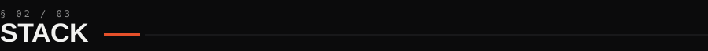
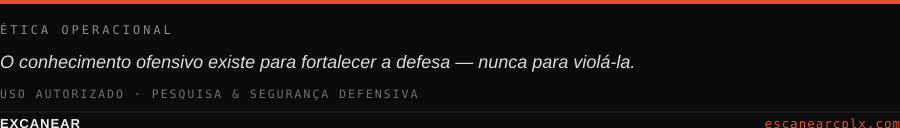

&nbsp;

**Segurança ofensiva, engenharia reversa e forense digital** — e as ferramentas que sustentam esse trabalho. O interesse não para na prova de conceito: desce até o binário, o kernel e o protocolo, sempre respondendo à mesma pergunta — *como isso funciona por baixo?*

&nbsp;

&nbsp;

<table>
  <tbody>
    <tr>
      <td align="center"><code>01</code></td>
      <td width="26%"><a href="https://github.com/excanear/OWASP-Bypass"><b>OWASP&nbsp;Bypass</b></a> <code>Python</code></td>
      <td>Engine autônomo de exploração web. <b>106 de 107</b> desafios do OWASP Juice Shop resolvidos de ponta a ponta.</td>
    </tr>
    <tr>
      <td align="center"><code>02</code></td>
      <td><a href="https://github.com/excanear/Web-Application-Reconnaissance-Investigation-Platform"><b>Web&nbsp;Recon&nbsp;Platform</b></a> <code>Python</code></td>
      <td>CLI de reconhecimento ofensivo: fingerprint real de tecnologia e versão, correlacionado a CVEs via NVD.</td>
    </tr>
    <tr>
      <td align="center"><code>03</code></td>
      <td><a href="https://github.com/excanear/devkit"><b>DEVKIT</b></a> <code>Assembly</code></td>
      <td>Toolkit de terminal escrito em <b>100% Assembly x86-64</b> — estático, sem uma única dependência.</td>
    </tr>
    <tr>
      <td align="center"><code>04</code></td>
      <td><a href="https://github.com/excanear/OSIRIS---Operational-System-Intelligence-Response-Investigation-System"><b>OSIRIS</b></a> <code>Rust</code></td>
      <td>Operational System Intelligence &amp; Response — inteligência operacional e investigação de sistema.</td>
    </tr>
    <tr>
      <td align="center"><code>05</code></td>
      <td><a href="https://github.com/excanear/Network-Kernel-Driver"><b>Network&nbsp;Kernel&nbsp;Driver</b></a> <code>Rust</code></td>
      <td>Driver de rede em nível de kernel — interceptação e inspeção abaixo do userspace.</td>
    </tr>
    <tr>
      <td align="center"><code>06</code></td>
      <td><a href="https://github.com/excanear/Sysinfo-Shell"><b>Sysinfo&nbsp;Shell</b></a> <code>Shell</code></td>
      <td>System info em shell POSIX puro, zero dependências: Linux, Windows, WSL, Git Bash e MSYS2.</td>
    </tr>
  </tbody>
</table>

<b>Arquivo completo — 40 repositórios</b>

 

**Ofensivo · AppSec** — `CVEs-Enterprise-System` · `Escanearcpl-Exploit-Tools` · `Hacking-Framework` · `Fuzzer-Vuln` · `PortScan-CPLX` · `WebScan` · `Crawler-de-Subdominios` · `Scanner-de-Portas`

**Reverse · Baixo nível** — `DLL-Hijacking-System` · `HyperVisor-Open-Source` · `Project-REXA` · `Arquitetura-de-CPU`

**Forense · DFIR** — `android-forensics-suite` · `Ferramenta-de-Analise-Forense-de-Memoria-e-Rede` · `Ferramenta-de-chunked-file-carving` · `Raw-Disk-Viwer-CPLX`

**Criptografia** — `Sistema-de-Criptografia-e-Descriptografia-Avancada-Open-Source` · `Criptografia-e-descriptografia-de-arquivos-AES` · `Gerador-de-Senhas-Hash`

&nbsp;

<table>
  <tbody>
    <tr valign="top">
      <td width="22%"><b>LINGUAGENS</b></td>
      <td><code>Python</code> <code>C</code> <code>C++</code> <code>C#</code> <code>Go</code> <code>Rust</code> <code>Java</code> <code>Assembly</code></td>
    </tr>
    <tr valign="top">
      <td><b>OFENSIVO · REDE</b></td>
      <td><code>Nmap</code> <code>Wireshark</code> <code>Burp&nbsp;Suite</code> <code>OWASP&nbsp;ZAP</code> <code>ffuf</code> <code>Gobuster</code> <code>Metasploit</code> <code>Kali&nbsp;Linux</code></td>
    </tr>
    <tr valign="top">
      <td><b>ENGENHARIA · WEB</b></td>
      <td><code>Docker</code> <code>Linux</code> <code>Git</code> <code>React</code> <code>Next.js</code> <code>TypeScript</code> <code>Tailwind</code> <code>GSAP</code></td>
    </tr>
  </tbody>
</table>

<b>Credenciais técnicas</b>

 

| Emissor | Credencial |
|---|---|
| Cisco / IBSEC | Certified Ethical Hacker (CEH) |
| IBSEC | Certified Pentester |
| Cisco | Cybersecurity Defense Analyst |
| Palo Alto | Cloud Security Professional · SOC Professional |
| Fortinet | Network Security Expert 3 |
| Linux Foundation | Linux Kernel Development |
| Securiti AI | AI Security &amp; Governance |

&nbsp;

Direção atual da pesquisa e do tooling — do userspace ao kernel.

- **Rust para segurança de sistemas** — [OSIRIS](https://github.com/excanear/OSIRIS---Operational-System-Intelligence-Response-Investigation-System) e [Network&nbsp;Kernel&nbsp;Driver](https://github.com/excanear/Network-Kernel-Driver): tooling confiável levado para perto do kernel.
- **Inteligência de vulnerabilidades em escala** — [CVEs&nbsp;Enterprise&nbsp;System](https://github.com/excanear/CVEs-Enterprise-System): correlação e gestão de CVE como sistema, não como script.
- **Criptografia de baixo nível** — [Criptografia Avançada](https://github.com/excanear/Sistema-de-Criptografia-e-Descriptografia-Avancada-Open-Source) implementada em Assembly, para entender a primitiva, não só usá-la.

&nbsp;

<a href="https://www.escanearcplx.com"><code>escanearcplx.com</code></a>

