&nbsp;

**Segurança ofensiva, engenharia reversa e forense digital** — e as ferramentas que sustentam esse trabalho. O interesse não para na prova de conceito: desce até o binário, o kernel e o protocolo, sempre respondendo à mesma pergunta — *como isso funciona por baixo?*

&nbsp;

&nbsp;

<b>REPOSITÓRIOS</b> &nbsp;·&nbsp; <a href="https://github.com/excanear/OWASP-Bypass">OWASP&nbsp;Bypass</a> &nbsp;·&nbsp; <a href="https://github.com/excanear/Web-Application-Reconnaissance-Investigation-Platform">Web&nbsp;Recon&nbsp;Platform</a> &nbsp;·&nbsp; <a href="https://github.com/excanear/devkit">DEVKIT</a> &nbsp;·&nbsp; <a href="https://github.com/excanear/OSIRIS---Operational-System-Intelligence-Response-Investigation-System">OSIRIS</a> &nbsp;·&nbsp; <a href="https://github.com/excanear/Network-Kernel-Driver">Network&nbsp;Kernel&nbsp;Driver</a> &nbsp;·&nbsp; <a href="https://github.com/excanear/Sysinfo-Shell">Sysinfo&nbsp;Shell</a>

<b>Arquivo completo — 40 repositórios</b>

 

**Ofensivo · AppSec** — `CVEs-Enterprise-System` · `Escanearcpl-Exploit-Tools` · `Hacking-Framework` · `Fuzzer-Vuln` · `PortScan-CPLX` · `WebScan` · `Crawler-de-Subdominios` · `Scanner-de-Portas`

**Reverse · Baixo nível** — `DLL-Hijacking-System` · `HyperVisor-Open-Source` · `Project-REXA` · `Arquitetura-de-CPU`

**Forense · DFIR** — `android-forensics-suite` · `Ferramenta-de-Analise-Forense-de-Memoria-e-Rede` · `Ferramenta-de-chunked-file-carving` · `Raw-Disk-Viwer-CPLX`

**Criptografia** — `Sistema-de-Criptografia-e-Descriptografia-Avancada-Open-Source` · `Criptografia-e-descriptografia-de-arquivos-AES` · `Gerador-de-Senhas-Hash`

&nbsp;

<b>Credenciais técnicas</b>

 

| Emissor | Credencial |
|---|---|
| Cisco / IBSEC | Certified Ethical Hacker (CEH) |
| IBSEC | Certified Pentester |
| Cisco | Cybersecurity Defense Analyst |
| Palo Alto | Cloud Security Professional · SOC Professional |
| Fortinet | Network Security Expert 3 |
| Linux Foundation | Linux Kernel Development |
| Securiti AI | AI Security &amp; Governance |

&nbsp;

&nbsp;

<a href="https://www.escanearcplx.com"><code>escanearcplx.com</code></a>

